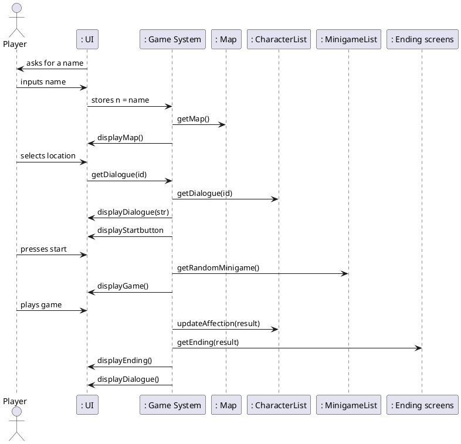

```plantuml

allow_mixing
hide circle
hide empty methods
hide footbox
actor "User" as user 

    class Player {
    name
    }
    class Map{
    Locations
    Character List
    }
    
    class Character{
    name
    affection points 
    map location
    dialogue
    ImageID
    }
    
    class Minigame{
    type
    instructions
    duration
    }
    
    class EndingScreens{
    game stats
    dialogue
    }
    
    class ImageIds{
    | 0 |  Zeus  |
    | 1 |  Shruck  |
    | 2 |  Bonny  |
    | 3 |  Satan  |
    | 4 |  Jojoson  |
    }
    
    Player -- Character : interacts with \t\t
    Player -- Minigame : plays the game
    Minigame -- Character :determines stats\t\t
    Minigame -- EndingScreens : leads to
    Map -- Character : selects character \t\t
    
   


```



```plantuml

class Character{
    name : String
    location : String
    affection : int 
    dialogue : List<String>
   
}

class CharacterMap{
    maplist : List<String>
    --
    public void addToMap(String location)
    public void getMap()
} 

class Controller {
    public void controllerGetCharacterMap()
    public void controllerGetCharacter(String location)
    public void controllerGetMinigame()
    public void controllerGetFinalCharacter(String decision)
}

class Endings {
    public void getEnding(int affection)
}

class Game{
    zeusd : List<String>
    shruckd : List<String>
    bonnyd : List<String>
    satand : List<String>
    jojosond : List<String>
    
    zeus : Character
    shruck : Character
    bonny : Character
    satan : Character
    jojoson : Character
    
    --
    public void makeCharacterMap()
    public void getCharacter(String location)
    public void makeMinigame()
    public void getFinalCharacter(String name)
    
}

class Minigame{
    minigames : List<String>
    --
    public void addToMinigame(String minigame)
    public void getMiniGame()
}

class Player{
    name : String 
    --
    public String getName(String name)
}

class UserInterface{
    public static void main(String [] args)

}

UserInterface .> Controller
Controller .> Player
Controller .> Game
Game .> Character
Game .> CharacterMap
Game .> Endings 
Game .> Minigame

@enduml
