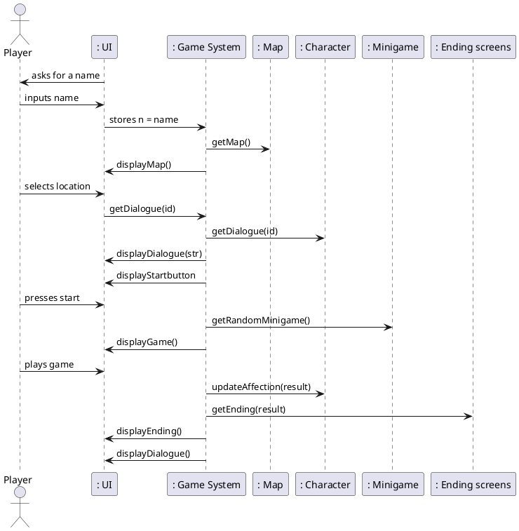

```plantuml

allow_mixing
hide circle
hide empty methods
hide footbox
actor "User" as user 

    class Player {
    name
    }
    class Map{
    Locations
    Character Buttons
    }
    
    class Character{
    name
    affection points 
    dialogue
    ImageID
    NumDates
    }
    
    class Minigame{
    type
    instructions
    duration
    }
    
    class EndingScreens{
    game stats
    dialogue
    }
   
    
    Player -- Character : interacts with \t\t
    Player -- Minigame : plays the game
    Minigame -- Character :determines stats\t\t
    Minigame -- EndingScreens : leads to
    Map -- Character : selects character \t\t
    
   


```



```plantuml

class Character{
    name : String
    affection : int 
    dialogue : List<String>
    imageId : int
    numDates : int
    
    public String getName()
    public String getAffection()
    public int setAffection(int affection)
    public int getImageId()
    public List<String> getDialogue()
    public int getNumDates()
}

class Controller {
    zeusd : List<String>
    shruckd : List<String>
    bonnyd : List<String>
    satand : List<String>
    jojosond : List<String>
    
    zeus : Character
    shruck : Character
    bonny : Character
    satan : Character
    jojoson : Character
    
    public void onSettingsClick() 
    public void onNewGameClicked() 
    public void onContinueClicked()
    public void onAddedName(String name, INameView view)
    public void onClickedSwamp()
    public void onClickedOlympus()
    public void onClickedFreds()
    public void onClickedHell()
    public void onClickedJapan()
    public void onClickedScreen()
    public void onClickedNext()
    public int numDates()
    public void onClickedYes()
    public void onClickedNo()
    public void onFinalClickedShruck()
    public void onFinalClickedZeus()
    public void onFinalClickedBonny()
    public void onFinalClickedSatan()
    public void onFinalClickedJojoson()
    public void onClickedAlone()
    public void onClickedDone()
    
}

class Endings {
    public void getEnding(int affection)
}

class Minigame{
    minigames : List<String>
    --
    public void addToMinigame(String minigame)
    public void getMiniGame()
}

class Player{
    name : String 
    numDates : int
    --
    public String getName()
    public void setName(String name)
    public int getNumDates()
    public void setNumDates()
}

class IActivityMainView{
    interface Listener 
    void onSettingsClick()
    View getRootView()
    void displayFragment()
    void hideMenu()
    void showMenu()
}


class ICharacterView{
     interface Listener: 
    void onClickedScreen()
}

class IDateView{
      interface Listener :
        void onClickedYes()
        void onClickedNo()
        int numDates()
    
}

class IEndingView {
    interface Listener :
        void onClickedDone()
    
}

class IKissingGameView {
    interface Listener:
        void onClickedNext()
}

class IMapView {
    interface Listener:
        void onClickedSwamp()
        void onClickedOlympus()
        void onClickedFreds()
        void onClickedHell()
        void onClickedJapan()
}    

class INameView {
    interface Listener:
        void onAddedName(String name, INameView view)
    
}    

class IRiddleGameView {
    interface Listener:
        void onClickedNext()
    
}

class ISelectionView {
    interface Listener:
        void onFinalClickedShruck()
        void onFinalClickedZeus()
        void onFinalClickedBonny()
        void onFinalClickedSatan()
        void onFinalClickedJojoson()
        void  onClickedAlone()
    
}

class ITitleView {
    interface Listener:
        void onNewGameClicked()
        void onContinueClicked()
    
}

class ITriviaGameView {
    interface Listener:
        void onClickedNext()
}
 

Controller .> Player
Controller .> Character
Controller .> Minigame
Controller .> Endings
Controller .> IActivityMainView
Controller .> ICharacterView
Controller .> IDateView
Controller .> IEndingView
Controller .> IKissingGameView
Controller .> IMapView
Controller .> INameView
Controller .> IRiddleView
Controller .> ISelectionView
Controller .> ITitleView
Controller .> ITriviaGameView


@enduml
