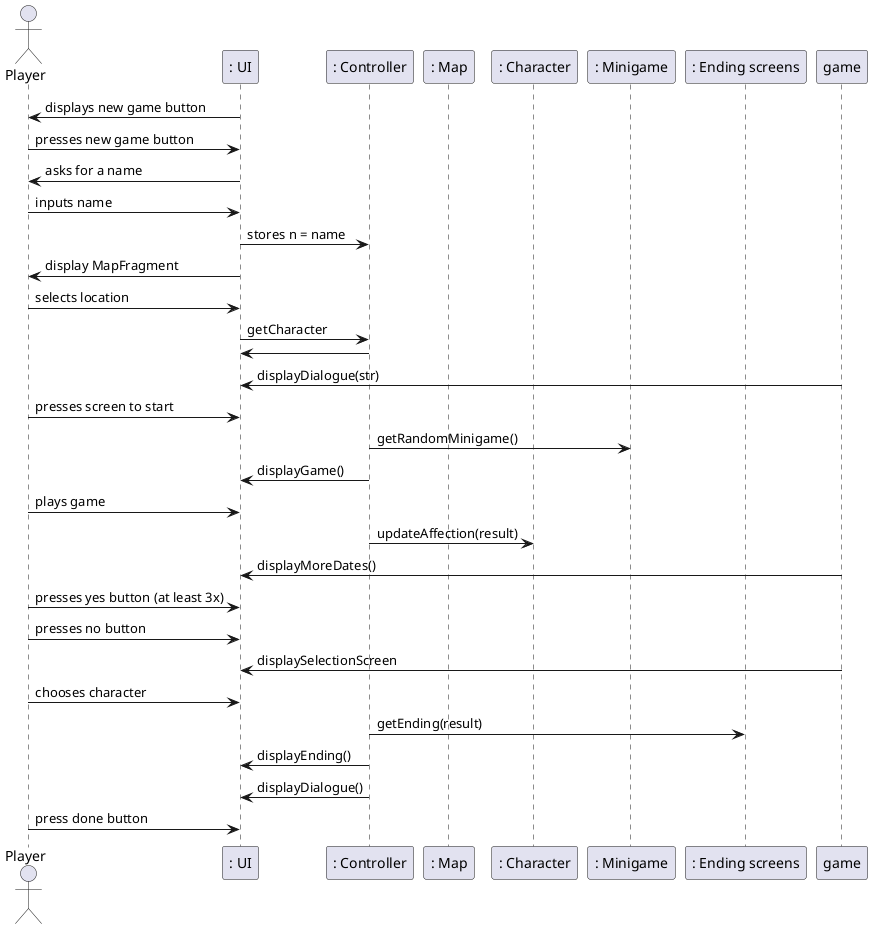

```plantuml

allow_mixing
hide circle
hide empty methods
hide footbox
actor "User" as user 

    class Player {
    name
    }
    class Map{
    Locations
    Character Buttons
    }
    
    class Character{
    name
    affection points 
    dialogue
    ImageID
    NumDates
 
    }
    
    class Minigame{
    type
    instructions
    score
    }
    
    class EndingScreens{
    game stats
    dialogue
    }
   
    
    Player -- Character : interacts with \t\t
    Player -- Minigame : plays the game
    Minigame -- Character :determines stats\t\t
    Minigame -- EndingScreens : leads to
    Map -- Character : selects character \t\t
    
   


```



```plantuml

class Character{
    name : String
    affection : int 
    dialogue : List<String>
    imageId : int
    numDates : int
    
    public String getName()
    public String getAffection()
    public int setAffection(int affection)
    public int getImageId()
    public List<String> getDialogue()
    public int getNumDates()
}

class Controller {
    zeusd : List<String>
    shruckd : List<String>
    bonnyd : List<String>
    satand : List<String>
    jojosond : List<String>
    
    zeus : Character
    shruck : Character
    bonny : Character
    satan : Character
    jojoson : Character
    
    public void onSettingsClick() 
    public void onNewGameClicked() 
    public void onContinueClicked()
    public void onAddedName(String name, INameView view)
    public void onClickedSwamp()
    public void onClickedOlympus()
    public void onClickedFreds()
    public void onClickedHell()
    public void onClickedJapan()
    public void onClickedScreen()
    public void onClickedNext()
    public int numDates()
    public void onClickedYes()
    public void onClickedNo()
    public void onFinalClickedShruck()
    public void onFinalClickedZeus()
    public void onFinalClickedBonny()
    public void onFinalClickedSatan()
    public void onFinalClickedJojoson()
    public void onClickedAlone()
    public void onClickedDone()
    
}

class Endings {
    public void getEnding(int affection)
}

class Minigame{
    minigames : List<String>
    --
    public void addToMinigame(String minigame)
    public void getMiniGame()
}

class Player{
    name : String 
    numDates : int
    --
    public String getName()
    public void setName(String name)
    public int getNumDates()
    public void setNumDates()
}

class Views{
}


 

Controller - Player
Controller - Character
Controller - Minigame
Controller - Endings
Controller - Views
```


```plantuml

skinparam titleBorderRoundCorner 15
skinparam titleBorderThickness 2
skinparam titleBorderColor red
skinparam titleBackgroundColor Aqua-CadetBlue

title View Package Diagram


class ActivityMainView{
    FragmentManager fmanager
    ActivityMainBinding binding
    Listener listener
}

class IActivityMainView{
    interface Listener 
    void onSettingsClick()
    View getRootView()
    void displayFragment()
    void hideMenu()
    void showMenu()
}

class CharacterFragment{
    FragmentCharacterBinding binding;
    Listener listener;
    private Character character;
    
    --
    public void onCreate()
    public View onCreateView()
    public void onViewCreated()
    public String getIntro()
    
}

class ICharacterView{
     interface Listener: 
     void onClickedCharacterScreen()
}

class DateFragment{

    FragmentDateBinding binding;
    Listener listener;
    int minNumDates;
    
    --
    public onCreateView()
    public void showNoButton()
}


class IDateView{
      interface Listener :
        void onClickedYes()
        void onClickedNo()
        int numDates()
    
}

class EndingFragment{
    FragmentEndingBinding binding;
    Listener listener;
    private Character character;
    private Endings endings;
    private Player player;
    --
    public void onCreate()
    public View onCreateView()
    public void onViewCreated()
    public String getResultEnding()
    public int getResultImage()
}


class IEndingView {
    interface Listener :
        void onClickedDone()
    
}

class KissingGameFragment{
    FragmentKissingGameBinding binding;
    Listener listener;
    private Character character;
    CountDownTimer cTimer;
    CountDownTimer donkeyTimer;
    private boolean isNoKissImage;
    private boolean isMiddleImage;
    private boolean isRightImage;
    private int kissCounter;
    private int kissScore;
    private int timesCaught;
    private int cycles;
    --
    public void onCreate()
    public View onCreateView()
    public onViewCreated()
    private void resetMainImageDrawable()
    private void updateMainImageDrawable()
    private void updtaeSmallImageDrawable()
    private void updateKissCounter()
    private void resetKissScore()
    updateTimesCaught()
}

class IKissingGameView {
    interface Listener:
        void onGameDone()
}

class MapFragment{
    FragmentMapBinding binding;
    Listener listener;
    
    --
    public void onCreate()
    public View onCreateView()
}

class IMapView {
    interface Listener:
        void onClickedSwamp()
        void onClickedOlympus()
        void onClickedFreds()
        void onClickedHell()
        void onClickedJapan()
}    

class NameFragment{
    FragmentNameBinding binding;
    Listener listener;
    --
    public void onCreate()
    public View onCreateView()
    public void onViewCreated()
}

class INameView {
    interface Listener:
        void onAddedName(String name, INameView view)
    
}    

class RiddleGameFragment{
    FragmentRiddleGameBinding binding;
    Listener listener;
    List<String> riddle = new ArrayList<>();
    List<String> riddleAnswers = new ArrayList<>();
    IMiniGame minigame;
    --
    public void onCreate()
    public View onCreateView()
    public void onViewCreated()
}

class IRiddleGameView {
    interface Listener:
        void onGameDone()
    
}

class SelectionFragment{
    FragmentSelectionBinding binding;
    Listener listener;
    --
    public void onCreate()
    public View onCreateView()
}

class ISelectionView {
    interface Listener:
        void onFinalClickedShruck()
        void onFinalClickedZeus()
        void onFinalClickedBonny()
        void onFinalClickedSatan()
        void onFinalClickedJojoson()
        void  onClickedAlone()
    
}

class TitleFragment{
    FragmentTitleBinding binding;
    Listener listener;
    --
    public View onCreateView()
}

class ITitleView {
    interface Listener:
        void onNewGameClicked()
        void onContinueClicked()
    
}

class TriviaGameFragment{
    FragmentTitleBinding binding;
    Listener listener;
    --
    public View onCreateView()
}

class ITriviaGameView {
    interface Listener:
    void onGameDone()
}

ActivityMainView - IActivityMainView
CharacterFragment - ICharaceterView
DateFragment - IDateView
EndingFragment - IEndingFragment
KissingGameFragment - IKissingGameView
MapFragment - IMapView
RiddleGameFragment - IRiddleGameView
SelectionFragment - ISelectionView
TriviaGameFragment - ITriviaGameView
TitleFragment - ITitleView 
NameFragment - INameView

@enduml


