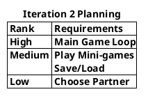
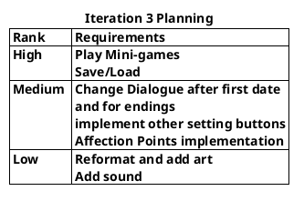

## Next Iteration (2)
Focus on coding and implementing Kissing mini-game(and possibly others) and editing our current code if needed.
This is one of our hardest mini-games and so it has a high risk.

## Next Iteration (3)
While we didn't get to implementing the kissing game just yet, we finished the overall loop and set the minimum date requirements.
For the next iteration, the minigames and save and load will be top priority. These are the hardest and most high risk things we have left.

