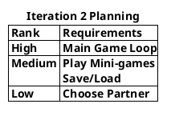

## Next Iteration (2)
Focus on coding and implementing Kissing mini-game(and possibly others) and editing our current code if needed.
This is one of our hardest mini-games and so it has a high risk.